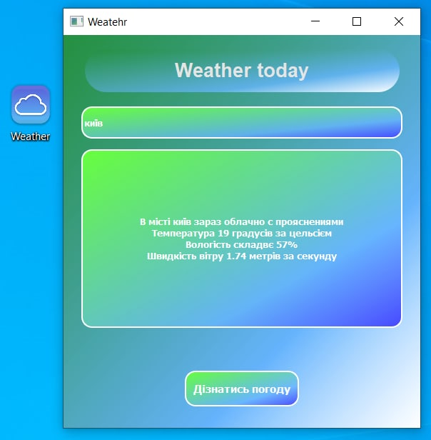

# Weather today v1.2

### What is the program for?

**Weather today v1.2** is an updated version of the program
previously published on this GitHub account
[Weather today v1.0](https://github.com/omelchenkoigor8388/Weather_today)

### What changes have been added to the updated version?

- The program received a new format **Weatger.exe**(This makes it 
easier for new users to launch the program)
- The program has received an updated icon in the thematic style
- Removed a difficult procedure for the user with the 
installation of a unique API key in the middle of the program files

### How to run the program?
In the updated version, the program received 
a new format and thus made it easier to run. 
To do this, download the 
[**Weather.exe**](https://github.com/omelchenkoigor8388/Weather_today.exe/tree/master/Weather_today.exe/dist) 
file to your PC and open it as a normal file / program.

### What was used to create the Weather today program?

- Files from Weather today v1.0
- **Pyinstaller** library for converting .py files to .exe
- Adobe Photoshop for making icons
